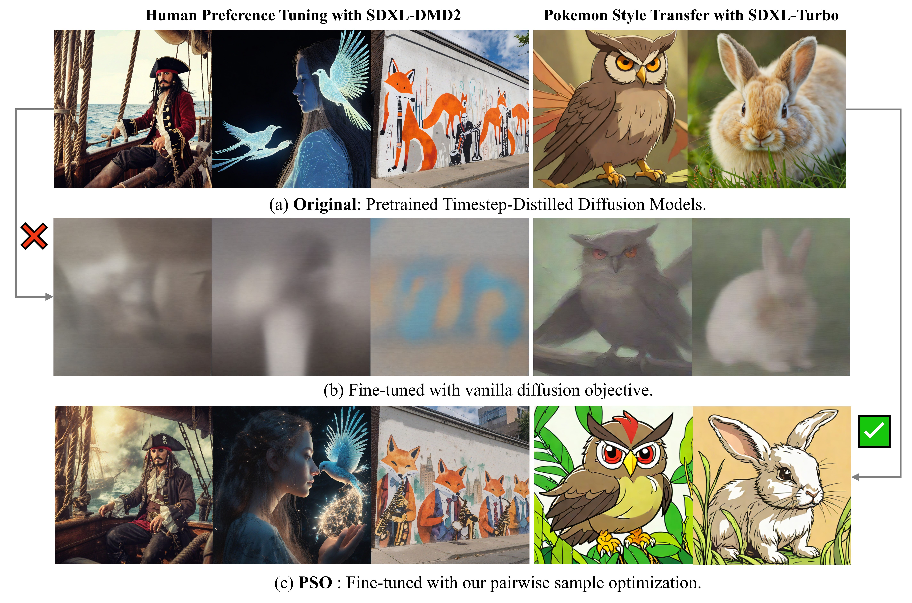

# Pairwise Sample Optimization
This is the official Pytorch implementation of the paper: [TUNING TIMESTEP-DISTILLED DIFFUSION MODEL
USING PAIRWISE SAMPLE OPTIMIZATION](https://arxiv.org/pdf/2410.03190).



## Installation
```
conda env create -f environment.yaml
```

## Fine-tuned Models
### Human Preference Tuning
SDXL-DMD2: [huggingface models](https://huggingface.co/ZichenMiao/PSO)

Usage (Evaluation on PickaPic-Test):
```
cd human_preference_tuning
accelerate launch eval_sdxl_dmd2.py
```

## Training
### Human Preference Tuning
* For SDXL-Turbo
```
bash Human_Preference_Tuning/online_pso_sdxl_turbo.sh
```

* For SDXL-DMD
```
bash Human_Preference_Tuning/online_pso_sdxl_dmd.sh
```

### Concept Customization
check scripts in 'personalization/scripts'


## Citation
If you find this work useful in your research, please consider citing:
```
@article{miao2024tuning,
  title={Tuning Timestep-Distilled Diffusion Model Using Pairwise Sample Optimization},
  author={Miao, Zichen and Yang, Zhengyuan and Lin, Kevin and Wang, Ze and Liu, Zicheng and Wang, Lijuan and Qiu, Qiang},
  journal={arXiv preprint arXiv:2410.03190},
  year={2024}
}
```


## Acknowledgements
This repo is built upon [D3PO](https://github.com/yk7333/D3PO). We thank the authors for their great work.
